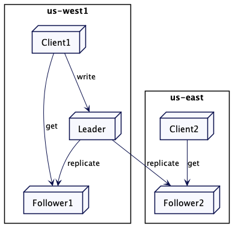

# 追随者读取（Follower Reads）

**原文**

https://martinfowler.com/articles/patterns-of-distributed-systems/follower-reads.html

为来自追随者的读取请求提供服务，获取更好的吞吐和更低的延迟。

**2021.7.1**

## 问题

使用领导者和追随者模式时，如果有太多请求发给领导者，它可能会出现过载。此外，在多数据中心的情况下，客户端如果在远程的数据中心，向领导者发送的请求可能会有额外的延迟。

## 解决方案

当写请求要到领导者那去维持一致性，只读请求就会转到最近的追随者。当客户端大多都是只读的，这种做法就特别有用。

值得注意的是，从追随者那里读取的客户端得到可能是旧值。领导者和追随者之间总会存在一个复制滞后，即使是在像 [Raft](https://raft.github.io/) 这样实现共识算法的系统中。这是因为即使领导者知道哪些值提交过了，它也需要另外一个消息将这个信息传达给跟随者。因此，从追随者服务器上读取信息只能用于“可以容忍稍旧的值”的情况。

图 1：从最近的追随者上读取
